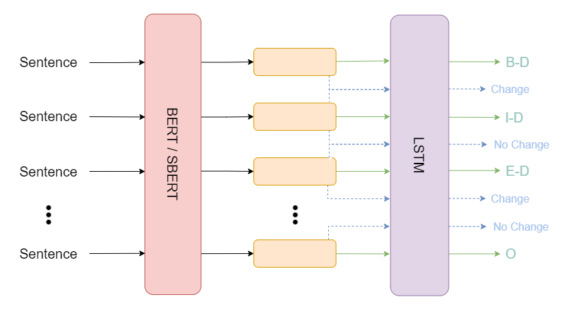

# Dialogue Detection

This is a repository for text-based dialogue detection.

## Descriptions
This model is trained with two tasks: speaker diarization and dialogue tagging. 

<p align="center">
  
</p>
<p align="center">
  <b>Figure:</b> BERT-LSTM Dialogue Detection
</p>

The following labels are used:
- Speaker diarization: binary classification of speaker change or not change between pairs of sentences
- Dialogue tagging: follows BIOE format:
  - B-D: Begin of dialogue
  - I-D: Inside of dialogue
  - E-D: End of dialogue
  - O: Outside

## Installation
Please install torch >= 1.6.

```bash
python -m pip install -e .
python -m pip install -r requirements.txt
```

## Usage
```bash
./train.sh
```
**Notes**: Remember to create data and checkpoint path.

## Contributing
Pull requests are welcome. For major changes, please open an issue first to discuss what you would like to change.

Please make sure to update tests as appropriate.

## License
[MIT](https://choosealicense.com/licenses/mit/)